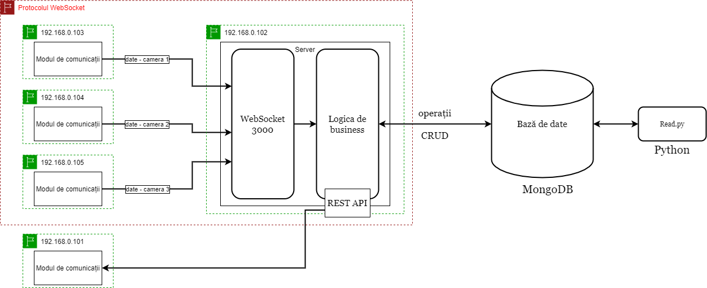
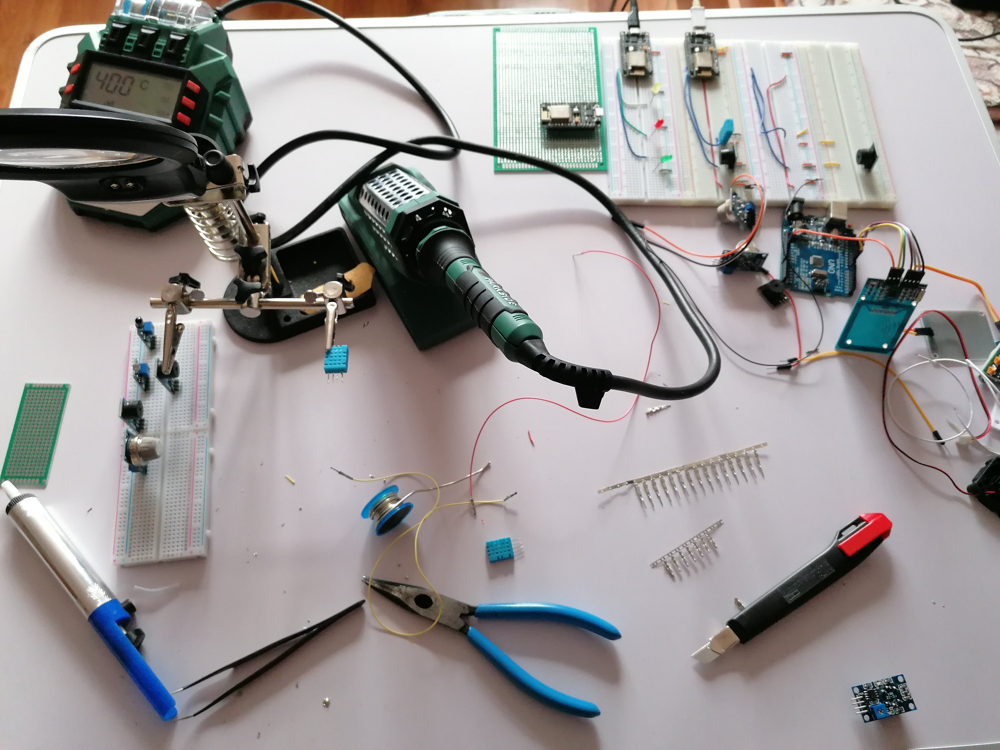
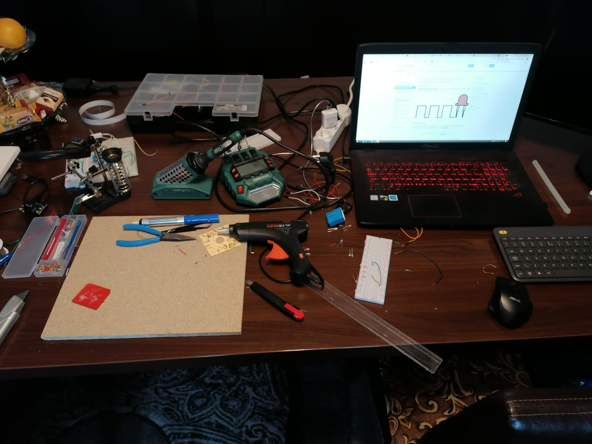
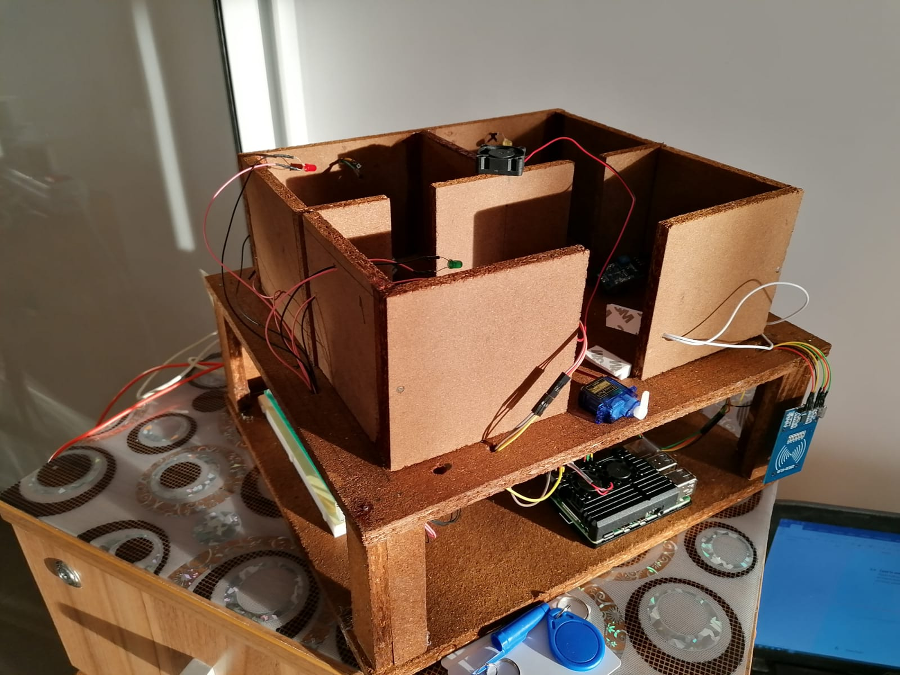
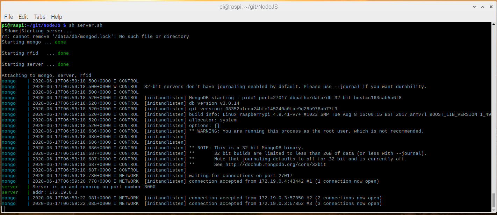
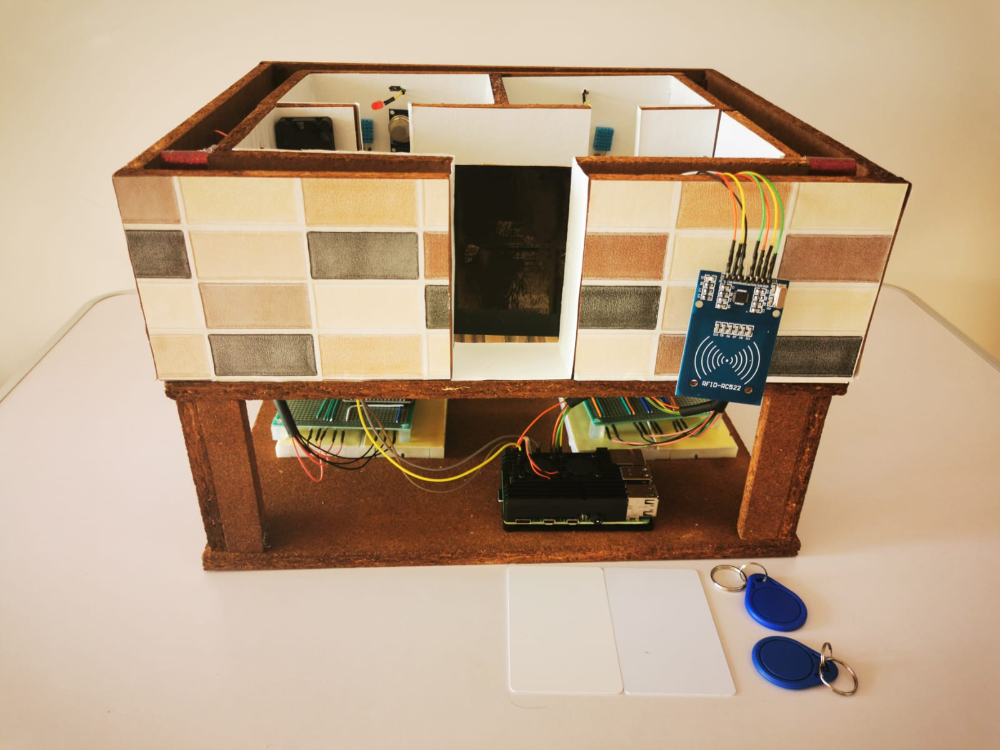
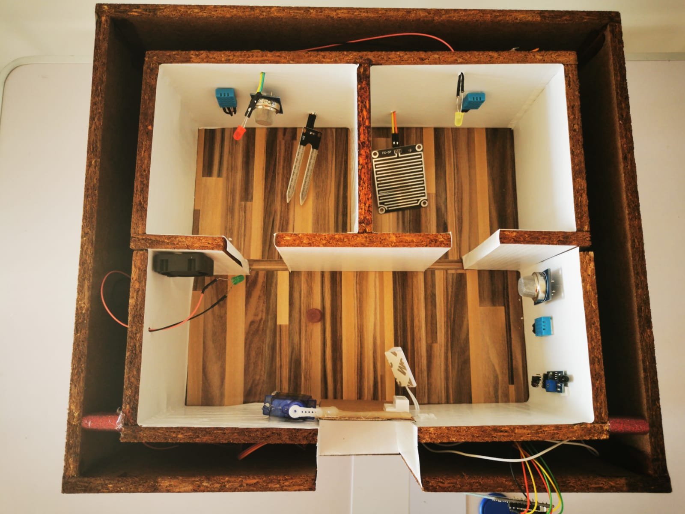
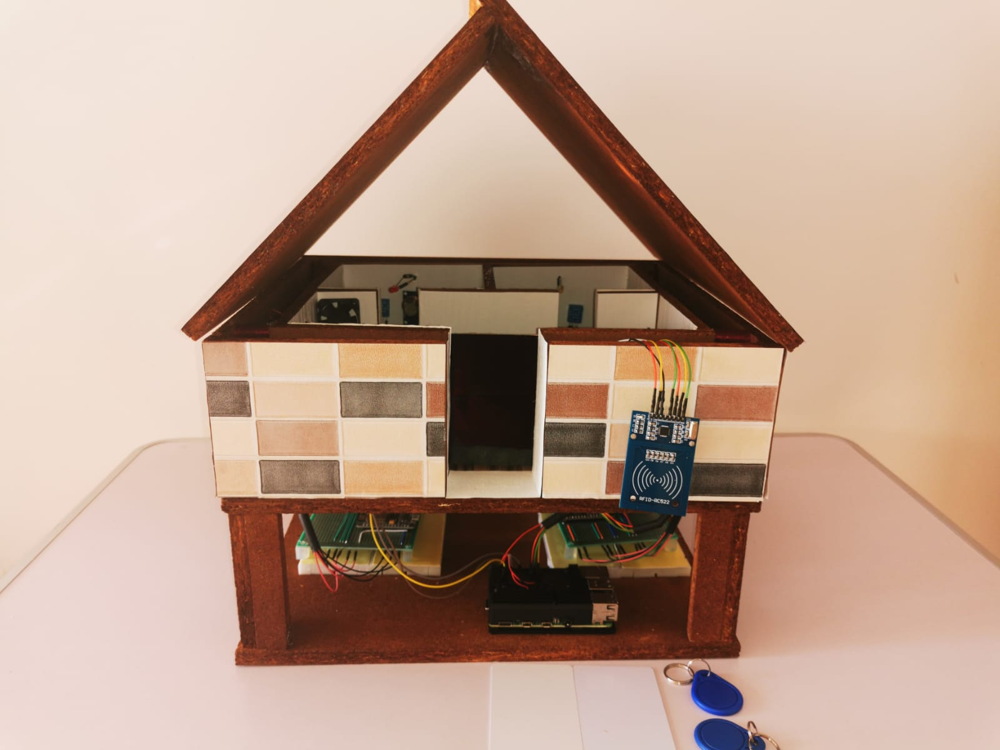

## Smart home🏡
I developed a miniature smart home, in which I combined software components with hardware. In developing the project I used Node.js, websocket, Ionic, Angular, Swagger, MongoDB, Arduino, Python, Raspberry PI 4B, Docker, sensors, NodeMCU ESP8266 modules, RFID module and many other components.

The smart home has the following functionalities, monitoring of temperature, humidity, gas, soil humidity, air quality, fire and water leak warning, lighting control in each room and air conditioning control. Card or tag based RFID access system with the possibility to add new users to the system in real time and access monitoring.

I used four NodeMCU ESP8266 WIFI modules for data transmission, 3 modules were used for data transmission from sensors to Node.js server via websocket. The fourth module was used to control lighting and air conditioning.

I used a NoSQL database to insert data from sensors, a Node.JS server and a program for RFID access developed in python. 

I also developed a mobile application with the help of Ionic, I created a REST consumer with Swagger Editor.

I also developed the hardware part

I created an access system with the help of an RFID module, I created a python program that reads GPIO from Raspberry PI.

Database, server and RFID program using docker-composed on a Raspberry PI 4B

In the first part of the project I developed a simplistic mobile application.

Learning more and more things I brought new functionality to the project, new sensors, new functions and a new look.

I also created an interface for the access system, in which we can add new users to the system, we can view user logins, the status of the door with a magnetic sensor and delete users.

I built a miniature house to highlight the functionalities.

This project took the First Place - [Session of Student Scientific Circles 2020](https://iesc.unitbv.ro/%C8%99tiri-%C8%99i-evenimente/470-sesiunea-cercurilor-stiintifice-studentesti-2020.html) at the University of Transylvania, Electrical Engineering and Computer Science, Specialization in Telecommunications Technologies and Systems.

If you want more details about this project contact me at dragomirdanielalin@gmail.com. Thanks